# Screen- und Zuschauerfluss für die Eishockey-Tombola

Stand: 25. Juli 2026

## Leitidee

Ein gemeinsamer, klarer Ablauf verbindet Halleneingang, Smartphone und Arena-Screen. Alle Oberflächen verwenden denselben serverseitigen Veranstaltungs- und Ziehungsstatus.

```mermaid
flowchart LR
  A["Eingangsplakat mit QR-Code"] --> B["Mobile Veranstaltungsseite"]
  B --> C["Lose auswählen und reservieren"]
  C --> D["Vereins-Mollie-Checkout"]
  D --> E["Mobile Bestätigung und Live-Link"]
  E --> F["Verkauf geschlossen"]
  F --> G["Synchroner Countdown auf Handy und Hallenscreen"]
  G --> H["Serverseitig feststehende Ziehung"]
  H --> I["Gewinnerlos groß und datensparsam"]
  I --> J["Gewinnabholung beim Vereinsstand"]
```



## 1. Eingangsplakat

**Oben:** Vereinslogo + „Heute: die digitale Fan-Tombola“  
**Mitte:** drei echte Gewinnbeispiele mit kleinen Piktogrammen  
**Fokus:** großer, kontrastreicher QR-Code  
**Handlung:** „Scannen · Lose wählen · beim dritten Drittel mitfiebern“  
**Pflichtbereich:** Veranstalter, Verkaufsende, Ziehungszeit, Kurzlink, Teilnahme-/Datenschutzhinweis

Nicht in die universelle Vorlage einbauen: fester Lospreis, feste Loszahl oder nicht freigegebene Backstage-Versprechen.

## 2. Mobile Verkaufsansicht

```text
┌──────────────────────────────┐
│ CLUBLOGO        HEIMSPIEL    │
│ Unterstütze unseren Nachwuchs│
│ Verkauf endet 20:35          │
├──────────────────────────────┤
│ HAUPTPREIS                    │
│ Club-Erlebnis [freigegeben]  │
├──────────────────────────────┤
│ Freie Lose                    │
│ 041  042  043  044           │
│ 045  046  047  048           │
├──────────────────────────────┤
│ 3 Lose ausgewählt            │
│ [Weiter zur sicheren Zahlung]│
└──────────────────────────────┘
```

Wichtige Zustände:

- `VERKAUF_OFFEN`: Auswahl möglich
- `RESERVIERT`: Restzeit sichtbar, keine künstliche Panik
- `ZAHLUNG_WIRD_GEPRÜFT`: noch kein Gewinnversprechen
- `BEZAHLT`: Losnummern und Vorgang bestätigt
- `VERKAUF_GESCHLOSSEN`: Live-Link bleibt verfügbar
- `ZIEHUNG_LÄUFT`: synchroner Countdown
- `ERGEBNIS`: Gewinnerlos und Abholhinweis

## 3. Hallenscreen vor der Ziehung

```text
┌──────────────────────────────────────────────────────┐
│ LIVE · FAN-TOMBOLA                    CLUBLOGO        │
│                                                      │
│          VERKAUF BEENDET                             │
│     684 gültige Lose im Lostopf                      │
│                                                      │
│  Prüfung abgeschlossen · Ziehung startet in 00:45    │
│                                                      │
│  Unterstützt durch: Sponsorhinweise                  │
└──────────────────────────────────────────────────────┘
```

Nur echte serverseitige Zahlen anzeigen. Keine Namen, E-Mails oder Zahlungsdaten.

## 4. Transparenzmoment

Vor dem Countdown für einige Sekunden zeigen:

- Anzahl gültiger bezahlter Lose
- Zeitpunkt des Verkaufsschlusses
- kurze Prüfreferenz beziehungsweise verkürzten Hash
- Text: „Das Ergebnis wird serverseitig bestimmt; die Animation stellt es nur dar.“

Die detaillierte Prüfseite kann über einen Kurzlink nach dem Spiel erreichbar sein.

## 5. Countdown und Ziehung

**Countdown:** 3–2–1, jeweils bildschirmfüllend  
**Animation:** Clubfarben, Puck-/Eisoptik, deutliche Bewegung ohne hektisches Flackern  
**Audio:** optional über Hallenregie; Bild muss ohne Ton verständlich sein  
**Regel:** Ergebnis ist vor Beginn der Animation serverseitig unveränderbar gespeichert

## 6. Gewinneranzeige

```text
┌──────────────────────────────────────────────────────┐
│                                                      │
│             DAS GEWINNERLOS                          │
│                                                      │
│                  0 4 2 7                             │
│                                                      │
│   Bitte mit Kaufbestätigung zum Tombola-Stand        │
│                                                      │
└──────────────────────────────────────────────────────┘
```

Standardmäßig nur Losnummer. Optional:

- „Gewinner/in bestätigt“ nach interner Prüfung
- Vorname + abgekürzter Nachname nur nach freiwilliger Freigabe
- Foto oder Kamerabild nur nach separater Einwilligung

## 7. Mobiles Ergebnis

Gewinner:

- „Dein Los 0427 wurde gezogen“
- Preis, Abholort, Frist und Identitätsprüfung
- keine öffentliche Aufforderung zur Selbstidentifikation

Nicht-Gewinner:

- wertschätzende Abschlussmeldung
- transparenter Vereinszweck und vorläufige Erlössumme nur wenn serverseitig korrekt
- kein sofortiges erneutes Glücksspielangebot

## 8. Plan B ohne Arena-Technik

### Technischer Plan B

- vereinseigener Laptop mit lokal vorbereiteter 16:9-Kioskansicht
- HDMI-Adapter, Verlängerung, eigener kleiner Beamer und Leinwand
- mobiler Router plus zweites Netz; keine Abhängigkeit vom offenen Hallen-WLAN

### Minimaler Plan B

- Verkauf rechtzeitig schließen und Kandidatensatz serverseitig sichern
- Ziehung auf dem Operatorgerät durchführen
- Gewinnerlos am Tombola-Stand und über mobile Live-Seite veröffentlichen
- Stadionsprecher verliest ausschließlich die Losnummer
- vorbereitete A3-Tafel/Whiteboard zeigt die Nummer

### Vollständiger Offline-Ausfall

- keine improvisierte neue Zufallsauswahl ohne dokumentierte Regel
- in Teilnahmebedingungen festgelegten Ersatztermin aktivieren
- Verkauf bleibt geschlossen
- Status und Begründung protokollieren
- Teilnehmer über den angegebenen Kontaktweg informieren

## 9. Hallen-Generalprobe

- Auflösung, Seitenverhältnis und Fernlesbarkeit vom entferntesten Platz prüfen
- Bedienung mit Hallenregie und Sprecher einmal komplett proben
- Uhrzeiten auf Server, Operatorgerät und Hallensystem abgleichen
- Ton-/Videoverzögerung prüfen
- Mobilfunklast mit mehreren Geräten simulieren
- Datenschutzcheck auf jedem Screen
- Plan-B-Wechsel innerhalb von höchstens zwei Minuten üben
